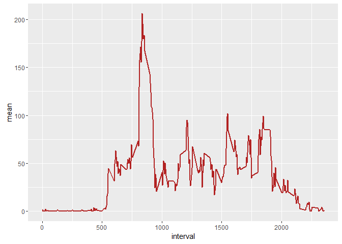

# Project Assignment 1- RR
Bharath  
May 28, 2016  
## Synopsis

This assignment analyses data from activty monitoring device. The data contains activity at 5 minute interval everyday for two months.
     

##Load the necessary packages     

```r
library(knitr)
library(tidyr)
library(dplyr)
```

```
## 
## Attaching package: 'dplyr'
```

```
## The following objects are masked from 'package:stats':
## 
##     filter, lag
```

```
## The following objects are masked from 'package:base':
## 
##     intersect, setdiff, setequal, union
```

```r
library(ggplot2)
```

```
## Warning: package 'ggplot2' was built under R version 3.2.5
```

```r
library(ggvis)
```

```
## Warning: package 'ggvis' was built under R version 3.2.5
```

```
## 
## Attaching package: 'ggvis'
```

```
## The following object is masked from 'package:ggplot2':
## 
##     resolution
```

```r
library(lubridate)
```
### Reading data from the activity file

```r
activity<-read.csv("activity.csv",stringsAsFactors = FALSE)
```
###Total number of steps taken a day

```r
activity.hist<-activity%>%filter(!is.na(steps)) %>%group_by(date)%>%summarize(steps=sum(steps,na.rm=TRUE))
ggplot(activity.hist)+aes(steps)+geom_histogram(fill="firebrick")+labs(x="Number of steps",y="frequency",title="Histogram of number of steps")
```

```
## `stat_bin()` using `bins = 30`. Pick better value with `binwidth`.
```


Mean steps taken a day

```r
activity.summary<-activity.hist%>%summarize(mean=mean(steps,na.rm=TRUE),median=median(steps,na.rm=TRUE))
```
###Average daily activity pattern

```r
activity.times<-activity%>%filter(!is.na(steps))%>%group_by(interval)%>%summarise(mean=mean(steps))
ggplot(activity.times)+aes(interval,mean)+geom_line(color="firebrick",size=1)
```



```r
 activity.times[which.max(activity.times$mean),]
```

```
## Source: local data frame [1 x 2]
## 
##   interval     mean
##      (int)    (dbl)
## 1      835 206.1698
```

##Imput missing values
####Strategy for imputing : 
Missing data needed to be imputed. Only a simple imputation approach was required for this assignment. Missing values were imputed by inserting the average for each interval.


```r
data_imput<-activity
datamiss<-is.na(activity$steps)
intervalmean<- tapply(data_imput$steps, data_imput$interval, mean, na.rm=TRUE, simplify = TRUE)
data_imput$steps[datamiss] <- intervalmean[as.character(data_imput$interval[datamiss])]

dataimputnew<-data_imput%>%filter(!is.na(steps))%>%group_by(date)%>%summarise(sumofstep=sum(steps))
ggplot(dataimputnew)+aes(sumofstep)+geom_histogram()
```

```
## `stat_bin()` using `bins = 30`. Pick better value with `binwidth`.
```


```r
dataimputsummary<-dataimputnew%>%summarize(mean=mean(sumofstep,na.rm=TRUE),median=median(sumofstep,na.rm=TRUE))
```

`

##Weekdays and weekends


```r
data_imput$date<-ymd(data_imput$date)
week<-data_imput%>%mutate(week=ifelse(weekdays(data_imput$date)=="Saturday"|weekdays(data_imput$date)=="Sunday","weekend","weekday"))
weeknew<-week%>%group_by(interval,week)%>%summarize(avgsteps=mean(steps,na.rm=TRUE))

ggplot(weeknew)+aes(interval,avgsteps,color=week)+geom_line(size=1)+facet_wrap(~week)
```


